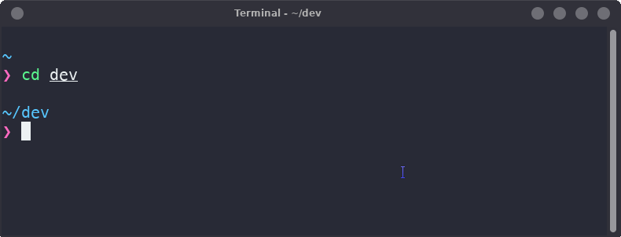

# hyper-snazzy-xfce4
The hyper-snazzy theme for the xfce4 terminal

## Installation
Clone this repository somewhere on your filesystem. Then copy the theme file into the xfce4 colorschemes folder.
```sh
git clone https://github.com/cblumens/xfce4-terminal-snazzy
cd xfce4-terminal-snazzy
cp hyper-snazzy.theme ~/.local/share/xfce4/terminal/colorschemes/hyper-snazzy.theme
```
